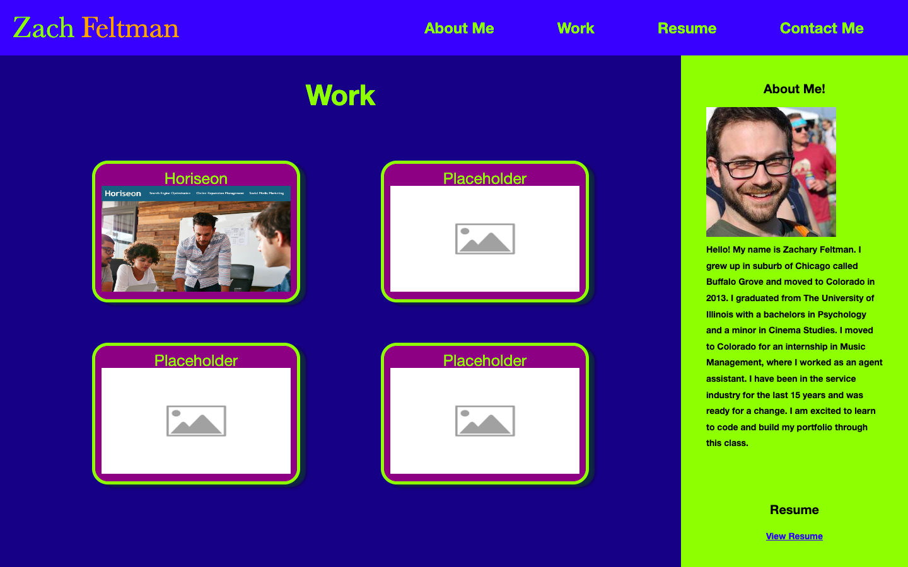

# Portfolio
Using HTML and CSS I have created an introductory page for my Web Development profile.  I have added information about me and how to contact me.  I have one project available (horiseon) and placeholder for future projects.

## Objectives:
 - I have added a photo of myself as well as information about be and how to contact me through various mediums.
 - When you click on the options in the navigation bar, it brings you to the corresponding area on the browser.
 - In the works section each "project" has a title, and one available options based on my finished work.
 - When you choose one of the applications, the chosen option gets larger than the others. Once selected it deploys the available work.
 - The screen adjusts to different viewport sizes as user changes the screen.
 
 ## Screenshot
 

## Live Link

https://zacharyfeltman.github.io/portfolio/